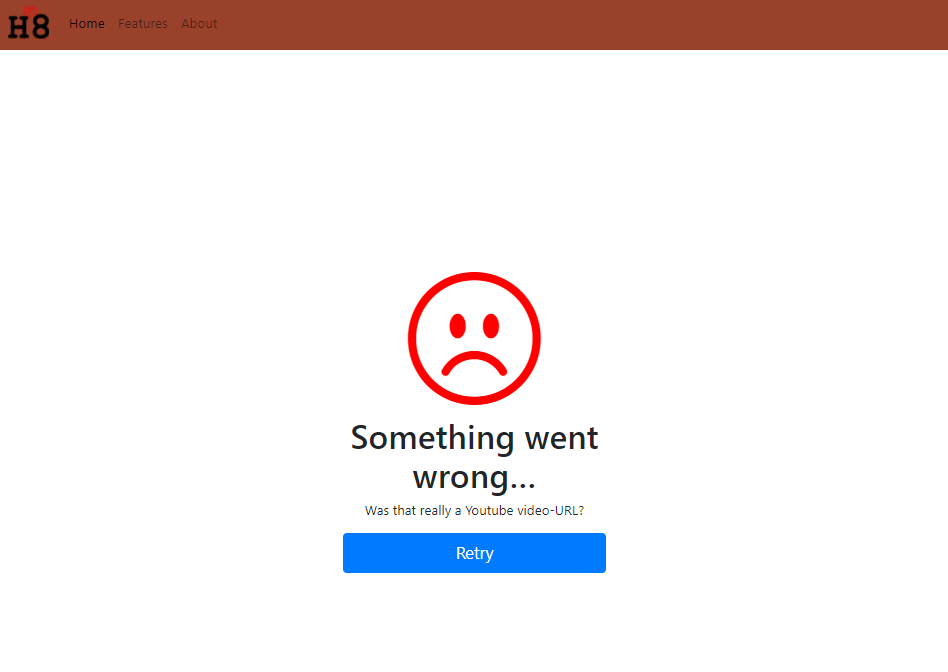
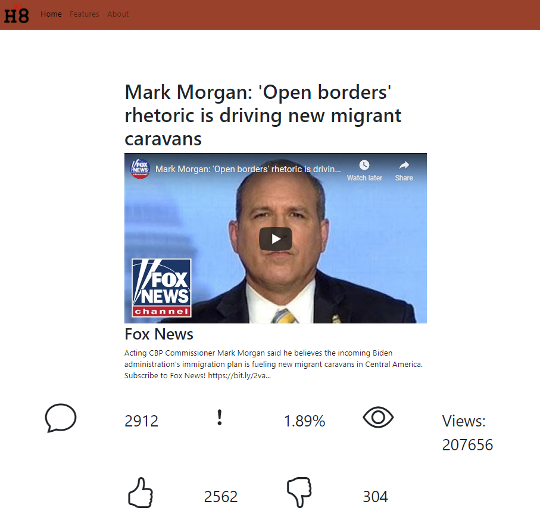
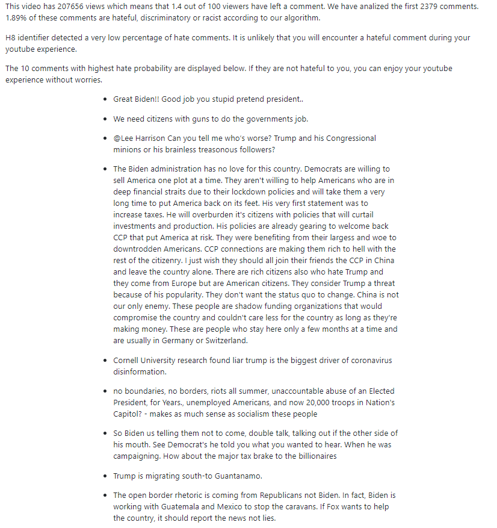
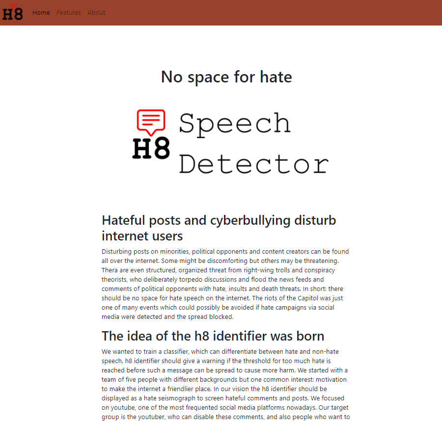

# h8 identifier - no space for hate

## Hateful posts and cyberbullying disturb internet users

Disturbing posts about minorities, political opponents, and content creators can be found all over the internet. Some might be discomforting but others may be threatening. There are even structured, organized threats from right-wing trolls and conspiracy theorists, who deliberately torpedo discussions and flood the news feeds and comments of political opponents with hate, insults, and death threats. In short: there should be no space for hate speech on the internet. The recent riots of the Capitol were just one of many events that could be avoided if hate campaigns via social media were detected and the spread blocked.

## The idea of the h8 identifier was born.

We wanted to train a classifier, which can differentiate between hate and non-hate speech. h8 identifier should give a warning if the threshold for too much hate is reached before such a message can be spread to cause more harm.
We started with a team of five people with different backgrounds but one common interest: motivation to make the internet a friendlier place. In our vision, the h8 identifier should be displayed as a hate seismograph to screen hateful comments and posts. We focused on Youtube, one of the most frequented social media platforms nowadays. Our target group is the YouTuber, who can disable these comments, and also people who want to enjoy a video without hateful comments. The h8 identifier should work as a browser extension rather than a bot and ideally should have its own website for users to have a review and give feedback.

Our team consists of three more experienced and two newbie-yet-motivated techies. Our project divided into two chunks:

1. Developing a Machine Learning pipeline which takes comments of a Youtube video and generates a feasible prediction of the hate.
2. Developing a web application and visualize the personalized results of the hate in statistics relevant for the user.

# A The Machine Learning pipeline: from the youtube url to the hate prediction

## 1. Input Youtube comments in a JSON with a Youtube API.

Google offers multiple Youtube APIs for different usage. The official Python client library can be found here [Google API Client](https://googleapis.github.io/google-api-python-client/docs/epy/index.html). We found a suitable API to export youtube comments in a JSON file. Thanks to this helpful [repository.](https://github.com/googleapis/google-api-python-client)

One major limitation of the the Youtube API ([Comments: list](https://developers.google.com/youtube/v3/docs/comments/list)) is the limitation of 100 items per request. Nevertheless, this enables us to predict the hatefulness of the most recent 100 comments of a video.

Our solution for that problem: Using pageToken parameter from the API we can analyze all comments and subcomments. We successfully implemented that feature on 30.01.2021.

Next step is to filter for youtube comments ignoring irrelevant information such as the comment author&#39;s name.

## 2. Format and clean the data for the classifier to understand

We extracted the text of comments and subcomments. Then we organized them in a pandas dataframe for further analysis. Major concerns were non -text characters such as @, #, : , etc. The [tweet-preprocessor library](https://pypi.org/project/tweet-preprocessor/) was a good start to clean the data.

Since our model won&#39;t understand human language, the cleaned comments are converted in a numerical form: First the comments are tokenized into words, then the model will go through the stack of comments to count for each word. For that task we use the CountVectorizer from sklearn.

## 3. Choose a suitable classifier, train and pickle it

We searched for a natural language processor and a binary classifier which is trained on an ideally large pre labeled dataset: either hateful text or non hateful text. First we found github repositories that specialized in hate classification for text. However most of them where not actively maintained or were 2 years old using python 2 which caused problems in package version compatibility. One of them used a binary classifier BERT provided by tensorflow, which was primarily interesting for us since it is still actively maintained. However it required a tensorflow 2.4 version to run whereas in the script was based on tensorflow 1 and consists of packages not compatible with tensorflow 2.4.

For the start we decided to use a simple NLP classifier, which worked well in the [Twitter Sentiment Analysis](https://github.com/topics/twitter-sentiment-analysis) and does not cause problems in version compatibility.  We applied a supervised learning model, calles Support Vector Classifier (SVC), which can be used for binary or multi class classification onto our data.

We trained it with a large pre labeled data set of hateful vs. non-hateful twitter posts available on kaggle: [https://www.kaggle.com/arkhoshghalb/twitter-sentiment-analysis-hatred-speech](https://www.kaggle.com/arkhoshghalb/twitter-sentiment-analysis-hatred-speech). Hateful comments are labeled as 1, the rest as 0. Using the train\_test\_split function of sklearn we divided the data set in 70% training and 30% test data.  The accuracy of 95% convinced us to stay with this model and pickle it for further later application.

## 4. Create a function for the frontend

Having pickled the model and the vectorizer we defined a prediction() function to apply the model to data with at least one column with comments labeled as &quot;tweet&quot;. The output is a list containing following elements:

- a pandas dataframe with the first 10 hateful (labeled as 1) comments
- the count of hate comments
- the count of all analyzed comments
- the ratio of hateful comments within all checked comments

For further analysis, we saved the following variables from our predict(df) function, which will not be displayed on our website due to the vast amount of comments:

- a numpy array called y\_pred\_svm: It contains the predictions for all the comments labeling 1 for hate and 0 for non-hate.
- hateful\_comments is a list consisting of all comments (tweet) which are labeled as hate (1)

Then we integrated it to the request from Youtube API making a two new functions  called get\_id\_from\_url(url) and get\_predictions(videoID). The first function takes a youtube-url, parses the youtube video ID. The prediction function takes that ID for the get request and all comments are inputted into the pipeline returning the above mentioned predictions.

## 5. Possible Limitations of the model

First, we detected some errors in the labeling of the comments during our cross check of the training data. We then created a file with comments to test our model. Curiously comments with &quot; so trash&quot; were labeled wherase &quot;shit&quot; was not considered as hate. Moreover long comments are more likely to be labeled hateful than short comments.

Second, nearly all of the comments were in English, thus comments in other language might be falsely labeled as hate. Therefore our model is only to be applied on English comments.

Nevertheless the majority of us decided to stick with this classifier to keep the pipeline going. In case we find a more suitable classifier in the future or more accurate training data, we can replace it.

# B Our results

Using the flask framework and the UX Design drafted with figma we created a the h8 identifier web application.

Our homepage can also be accessed when selecting the H8 symbol.

In case no valid youtube url was inputted, this error message is shown.

If a valid youtube video was inputted, we display the video details including the views, comments, likes and dislikes.

We analyzed a representative number of comments calculate the hate ratio, give a feedback to the user according to the hate ratio that ratio. Then we show the 10 comments with highest hate probability below. A disclaimer is added &quot;If they are not hateful to you, you can enjoy your youtube experience without worries.&quot;.

The about page gives more insights about our project goal.

**Contributors** :

- Urs Schmidt
- Thuy Anh Nguyen
- Robin van de Water

We thank our mentor Felix Linker who kept us motivated and gave us guidance and input whenever needed.

Thank you Maiuran and Wahid for your input.

**References**

1 Youtube API [Comments: list  |  YouTube Data API  |  Google Developers](https://developers.google.com/youtube/v3/docs/comments/list)[googleapis/google-api-python-client:  🐍 The official Python client library for Google&#39;s discovery based APIs. (github.com)](https://github.com/googleapis/google-api-python-client)

2 NLP classifier [Twitter-Sentiment-Analysis/Twitter\_Sentiment\_Analysis\_Support\_Vector\_Classifier.ipynb at master · importdata/Twitter-Sentiment-Analysis (github.com)](https://github.com/importdata/Twitter-Sentiment-Analysis/blob/master/Twitter_Sentiment_Analysis_Support_Vector_Classifier.ipynb)